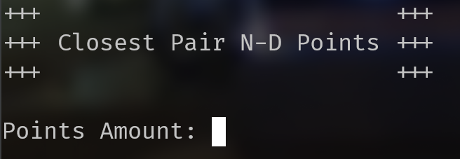

# Mencari Pasangan Titik Terdekat dengan Algoritma Divide and Conquer

Mencari pasangan titik terdekat merupakan suatu persoalan yang dapat kita jumpai dalam dunia nyata, seperti pada bidang genetika dan penerbangan. Jarak antara dua titik dihitung dengan rumus *Euclidian* pada suatu dimensi D. Salah satu algoritma yang dapat digunakan untuk memecahkan persoalan ini dengan cukup efisien adalah *Divide and Conquer*. Secara garis besar algoritma *Divide and Conquer* membagi persoalan menjadi bagian-bagian yang lebih kecil, kemudian solusi dari setiap bagian-bagian kecil tersebut digabungkan untuk memperoleh solusi keseluruhan. Program ini menghitung dan mencari pasangan titik terdekat tersebut dengan menggunakan algoritma *Divide and Conquer* pada suatu dimensi D.

## Daftar Isi
- [Struktur Repositori](#struktur-repositori)
- [Minimum *Requirements*](#minimum-requirements)
- [Cara *Build* Program](#cara-build-program)
- [Cara Menjalankan Program](#cara-menjalankan-program)
- [Modifikasi Program](#modifikasi-program)
- [Catatan](#catatan)


## Struktur Repositori
```bash
.
├── Makefile
├── README.md
├── assets
│   └── images
│       └── tampilan-awal.png
├── bin
│   ├── darwin-amd64
│   ├── darwin-arm64
│   ├── linux-amd64
│   ├── linux-arm64
│   ├── win-amd64.exe
│   └── win-arm64.exe
├── doc
│   └── Tucil2_13521150.pdf
├── output
│   └── result.png
└── src
    ├── algorithm
    │   ├── bruteforce.go
    │   └── dnc.go
    ├── go.mod
    ├── go.sum
    ├── io
    │   ├── input.go
    │   ├── output.go
    │   └── screen.go
    ├── main.go
    ├── plot
    │   ├── plot.py
    │   ├── points.csv
    │   └── ppoints.csv
    └── point
        └── point.go
```

## Minimum *Requirements*
*Requirements* `Go v19.0` hanya diperlukan jika ingin melakukan [*build*](#cara-build-program) atau menjalankan program dengan [alternatif 2](#alternatif-2). Anda dapat menjalankan program dengan [alternatif 1](#alternatif-1) tanpa memerlukan *requirements* tersebut.
- Go v19.0
- Python v3.8.10
    - Matplotlib v3.7.0
    - Pandas v1.5.3

## Cara *Build* Program
1. *Clone* repositori ini
2. Pastikan Anda telah berada pada `root` direktori repositori
3. Jalankan perintah `make build` pada terminal
4. Selanjutnya akan terbentuk 4 buah *executable* yang dapat Anda pilih sesuai dengan jenis sistem operasi Anda

## Cara Menjalankan Program

### Alternatif 1
1. Pastikan Anda telah berada di folder `bin`
2. Jalankan program dengan menggunakan perintah berikut pada terminal

    ```bash
    # windows (pilih salah satu)
    win-amd64.exe
    win-arm64.exe

    # linux (pilih salah satu)
    ./linux-amd64
    ./linux-arm64

    # macOS (pilih salah satu)
    ./darwin-amd64
    ./darwin-arm64
    ```
### Alternatif 2
1. Pastikan Anda telah berada pada `root` direktori repositori
2. Jalankan program dengan menggunakan perintah `make run` pada terminal

Baik untuk alternatif 1 maupun 2, jika program telah berjalan dengan baik, maka Anda akan melihat tampilan sebagai berikut,



### *Visualizer*
Khusus untuk dimensi 3, Anda dapat melihat visualisasi titik dengan melakukan langkah-langkah berikut,
1. Pastikan Anda telah berada pada `root` direktori repositori
2. Gunakan perintah `make run-visualizer` pada terminal
3. Jika berhasil, maka akan muncul suatu *pop-up window* yang menampilkan visualisasi titik. Selain itu, juga terdapat output visualisasi titik dalam format .png yang dapat dilihat pada folder `output` 

P.S. Gunakan *vi

## Modifikasi Program
> *WARNING*: 

>Semua aksi yang dilakukan pada tahap ini dapat menyebabkan program tidak berjalan sebagaimana mestinya, harap dikondisikan. Seperti kata Uncle Ben, `"With great power comes great responsibility"`

Anda dapat memodifikasi batasan limit jumlah titik dan dimensi. Berikut adalah langkah-langkahnya,
1. Buka file `src/io/input.go`
2. Pada baris 33 dan 34 terdapat dua buah variabel, yaitu `N` dan `dimension`, Anda dapat memodifikasi angka yang dijadikan argumen pemanggilan fungsi `GetInput`, yaitu angka pertama (argumen kedua) merupakan batas bawah dan angka kedua (argumen ketiga) merupakan batas atas

Selain itu, Anda juga dapat memodifikasi range pembangkitan titik. Berikut langkah-langkahnya,
1. Buka file `src/point/point.go` 
2. Pada baris 58 terdapat angka *default* sebesar `1000000`, Anda dapat menggantinya dengan angka yang diinginkan

Selanjutnya Anda dapat menguji hasil modifikasi dan menjalankan program dengan menggunakan cara pada bagian [Cara Menjalankan Program](#alternatif-2) alternatif 2

## Catatan
- Visualizer hanya dapat digunakan untuk dimensi 3
- Jika ingin menggunakan visualizer, disarankan jumlah titik tidak terlalu banyak (<=1000), karena akan membutuhkan waktu yang cukup lama untuk *compiling*

Mady with ❤️ by I Putu Bakta Hari Sudewa (13521150)